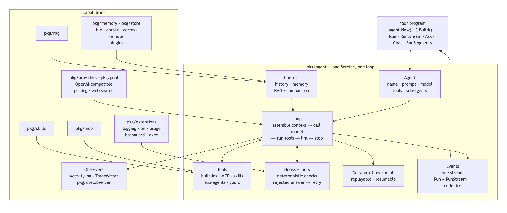

# AgentGo

[](https://github.com/liliang-cn/agent-go/actions/workflows/ci.yml)
[](https://pkg.go.dev/github.com/liliang-cn/agent-go/v3)
[](https://goreportcard.com/report/github.com/liliang-cn/agent-go/v3)
[](https://github.com/liliang-cn/agent-go/releases)
[](LICENSE)

A Go library for running an agent loop: tools, memory, MCP, skills, sessions, checkpoints, lints, long runs. No CLI, no UI, no server — embed `pkg/agent` in your own program.



[中文文档](README_zh-CN.md)

## Install

```bash
go get github.com/liliang-cn/agent-go/v3
```

Go 1.25+.

## Use

```go
package main

import (
	"context"
	"fmt"
	"log"
	"os"

	"github.com/liliang-cn/agent-go/v3/pkg/agent"
	"github.com/liliang-cn/agent-go/v3/pkg/pool"
)

func main() {
	llm, err := pool.NewClient("deepseek", "https://api.deepseek.com/v1", os.Getenv("DEEPSEEK_API_KEY"), "deepseek-v4-flash")
	if err != nil {
		log.Fatal(err)
	}

	svc, err := agent.New("assistant").
		WithLLM(llm).
		WithPrompt("You are a concise Go assistant.").
		WithMemory(agent.WithMemoryStoreType("file")).
		Build()
	if err != nil {
		log.Fatal(err)
	}
	defer svc.Close()

	reply, err := svc.Ask(context.Background(), "What is AgentGo?")
	if err != nil {
		log.Fatal(err)
	}
	fmt.Println(reply)
}
```

Without `WithLLM`, providers come from `AGENTGO_HOME/data/agentgo.db`.

| call | returns | use when |
| --- | --- | --- |
| `svc.Ask(ctx, q)` | `(string, error)` | one question, one answer |
| `svc.Chat(ctx, q)` | `*ExecutionResult` | multi-turn, session kept |
| `svc.Stream(ctx, q)` | `<-chan string` | tokens as they arrive |
| `svc.Run(ctx, goal, opts...)` | `*ExecutionResult` | a goal, with tools and run options |
| `svc.RunStream(ctx, goal)` / `RunStreamWithOptions` | `<-chan *Event` | every runtime event |
| `svc.RunSegments(ctx, goal, LongRunConfig{...})` | `*LongRunResult` | one task across many runs |

Wiring memory, a knowledge graph, web search and plans into a host: [docs/getting-started.md](docs/getting-started.md). Runnable examples, one per feature: [`examples/`](examples/).

## Builder options

| option | what it adds |
| --- | --- |
| `WithLLM(gen)` / `WithConfig(cfg)` | the model, or a config that names providers |
| `WithPrompt(s)` / `WithSystemPrompt(s)` | the system prompt |
| `WithMemory(opts...)` / `WithGraphMemory()` / `WithMemoryService(svc)` | durable memory; `store_type` file, cortex, cortex-remote, mcp-memory, mem0, qdrant, meilisearch, weaviate, surrealdb, or `RegisterMemoryStore` |
| `WithEmbedder(e)` / `WithRAG()` | document retrieval |
| `WithMCP(opts...)` / `WithSkills()` | tools from MCP servers; SKILL.md workflows |
| `WithTool(s)(...)` / `AddToolWithMetadata` | your own tools; `ToolMetadata{ReadOnly, Destructive, OutputLimit, ...}` |
| `WithSubagents(specs...)` | a `task(agent_name, prompt)` tool |
| `WithSandbox(sb)` / `WithAutonomy(profile)` / `WithMaxTurns(n)` | where tools run; round budget |
| `WithPlanStore(ps)` / `WithTaskStore(ts)` / `WithRunMemory(rm)` | persistence for plans, tasks, run memory |
| `WithExtensions(...)` / `WithObserver(...)` | seams: logging, pii, usage, bashguard, exec; ActivityLog, TraceWriter, OTel |
| `WithPromptCache(...)` / `WithToolOutputLimit(n)` | prompt cache breakpoints; cap on one tool result |
| `WithMaxConcurrentRuns(n)` / `WithMaxRunsPerTenant(n)` / `WithBackgroundTasks(max)` | capacity |
| `WithDecisionEngine(e, conf)` / `WithTimezone(loc)` / `WithOptions(agent.Options{...})` | the rest |

## Run options

| option | effect |
| --- | --- |
| `WithMaxTurns(n)` / `WithMaxTokens(n)` / `WithTemperature(t)` / `WithThinking(bool)` | budget and sampling |
| `WithLLMRetries(n)` / `WithMaxBudgetUSD(x)` | retries; stop when spend exceeds the budget |
| `WithToolsDisabled()` / `WithToolAllowlist(names)` / `WithToolDenylist(names)` | the tool surface |
| `WithStructuredOutput(spec)` / `WithStructuredOutputType[T]()` | enforce a JSON shape |
| `WithRequiredDeliverables(...)` / `WithRequestedActions(...)` / `WithConstraintExtraction(bool)` | the delivery contract |
| `WithSessionID` / `WithTaskID` / `WithRunID` / `WithParentTaskID` / `WithPlanKey` / `WithTenant` | identity, lineage, owner |
| `WithModel(model, provider...)` | which model answers this run |
| `WithMemoryUser(id)` / `WithoutMemoryAutoStore()` | whose memory; skip the automatic write |
| `WithResumeMessages(msgs)` / `WithPriorToolCalls(names)` | continue from history |
| `WithInputImages(paths...)` / `WithInputAudio` / `WithInputFiles` / `WithInputParts(...)` | multimodal input |
| `WithAutoCompaction(threshold, keep)` / `WithCompactionClipping(n)` / `WithoutAutoCompaction()` | compaction |
| `WithDebug(bool)` | verbose logging for one run |

## Providers

Any OpenAI-compatible endpoint: OpenAI, DeepSeek, Ollama, vLLM, DashScope/Qwen, gateways.

```toml
# agentgo.toml
[[llm.providers]]
name = "deepseek"
base_url = "https://api.deepseek.com/v1"
key = "..."
model_name = "deepseek-v4-flash"
native_web_search = "none"   # none | openai | dashscope | google_search
```

`pool.NewPool` load-balances across providers. `pool.RegisterModelPricing` prices a model the bundled table does not know; an unpriced model reports `CostUnpriced`, not `$0`.

## Storage

```text
~/.agentgo/                  # AGENTGO_HOME
├── data/agentgo.db          # config, providers, sessions, tasks, checkpoints, plans
├── data/cortex.db           # optional memory / vector / graph
├── memories/                # file memory
├── skills/                  # SKILL.md
└── workspace/               # agent working directory
```

## Packages

```text
pkg/agent         agent, loop, tools, context, hooks/lints, sessions, checkpoints, long runs
pkg/domain        shared types and interfaces
pkg/providers     OpenAI-compatible providers, LLMPool
pkg/pool          provider pool, pricing, cost, native web search
pkg/memory        memory service, BaseStore, memorystoretest
pkg/store         SQLite storage, memory store plugins
pkg/cortexbridge  CortexDB tools, RunMemory
pkg/mcp           MCP client and servers
pkg/skills        skill loading and ranking
pkg/rag           document retrieval
pkg/sandbox       local / Docker sandboxes
pkg/scheduler     scheduling with per-execution cancellation
pkg/extensions    logging, pii, usage, bashguard, exec
pkg/extensiontest test an extension through the real loop
pkg/otelobserver  Observer → OpenTelemetry
pkg/timeaware     relative time in stored text
pkg/decision      cheap closed-question engine
eval/             behavioural eval harness
examples/         runnable examples
```

## Development

```bash
make check          # fmt + vet + test
go test -race ./pkg/agent/...
make eval           # scripted model, CI-safe
make eval-live      # real provider
```

`CLAUDE.md` records the architecture decisions.

## License

MIT
