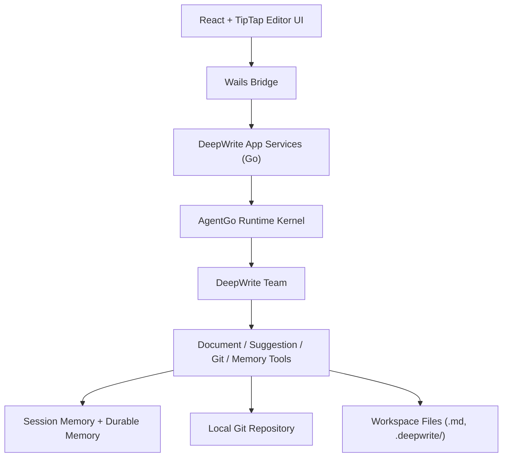

# DeepWrite Technical Architecture

## Overview

DeepWrite is a local-first desktop application built on top of AgentGo.

It should be treated as:

- a document-first writing IDE
- a desktop shell around an AgentGo runtime kernel
- a suggestion-driven editing system
- a Git-backed local versioning workspace

The application is not chat-first.

The primary object is the document.

## Technology Stack

Desktop shell:

- `Wails`

Frontend:

- `React`
- `TypeScript`
- `Vite`
- `TipTap` / `ProseMirror`

Backend / native layer:

- `Go`
- `AgentGo`
- local filesystem
- local Git

## Architecture Diagram



## Layered Design

## 1. UI Layer

Responsibilities:

- render the editor
- show suggestions and comments
- render version history
- show runtime progress and state
- collect user commands from the document context

Core views:

- Home
- Draft Wizard
- Editor Workspace
- Suggestion Panel
- Version Panel
- Settings

Important rule:

- the UI should not contain AI workflow logic

The UI sends structured actions.

The backend decides which agent or tool executes them.

## 2. Wails Bridge Layer

Responsibilities:

- expose Go services to the frontend
- stream runtime events to the UI
- forward editor actions to the backend

Recommended bridge APIs:

- `OpenWorkspace(path)`
- `CreateDocument(input)`
- `ImportDocument(input)`
- `RunDraft(input)`
- `RunRewrite(input)`
- `AcceptSuggestion(id)`
- `RejectSuggestion(id)`
- `ListVersions(docID)`
- `CreateVersion(docID, message)`
- `RestoreVersion(docID, revision)`
- `GetRuntimeState(docID)`

## 3. DeepWrite Application Layer

This is the product-specific backend layer that sits above AgentGo.

Responsibilities:

- map editor actions to AgentGo task requests
- manage active document sessions
- persist suggestion metadata
- coordinate workspace, files, memory, and Git services

Recommended modules:

- `WorkspaceManager`
- `DocumentService`
- `SuggestionService`
- `CommentService`
- `VersionService`
- `DeepWriteRuntimeService`
- `DeepWriteMemoryService`

## 4. AgentGo Runtime Kernel

AgentGo is the execution kernel.

Responsibilities:

- multi-turn runtime loop
- tool execution
- team orchestration
- memory recall and durable write-back
- runtime state transitions
- streaming events

DeepWrite-specific team:

- `WritingCaptain`
- `Outliner`
- `Drafter`
- `Rewriter`
- `Reviewer`
- `Archivist`
- `VersionKeeper`
- `Researcher`

## 5. Tool Layer

DeepWrite should expose product tools instead of letting agents mutate editor state directly.

### Document Tools

- `document_read`
- `document_insert`
- `document_replace_selection`
- `document_list_headings`

### Suggestion Tools

- `suggestion_create`
- `suggestion_list`
- `suggestion_accept`
- `suggestion_reject`

### Comment Tools

- `document_comment_add`

### Workspace Tools

- `workspace_list_documents`
- `workspace_create_document`
- `workspace_import_markdown`
- `workspace_import_text`
- `workspace_save_document`

### Version Tools

- `git_status`
- `git_diff`
- `git_commit`
- `git_log`
- `git_checkout_revision`

### Research Tools

- `web_search`

## Core Data Flow

## A. Draft Flow

```text
Home / Draft Wizard
  -> RunDraft(input)
  -> WritingCaptain interprets request
  -> Outliner (optional)
  -> Drafter produces content
  -> Reviewer (optional)
  -> DocumentService writes document
  -> UI opens editor with generated content
```

## B. Rewrite Flow

```text
Editor selection + instruction
  -> RunRewrite(input)
  -> WritingCaptain routes to Rewriter
  -> Archivist injects style/session memory
  -> Rewriter returns candidate revision
  -> SuggestionService stores suggestion
  -> UI renders diff
  -> User accepts/rejects
  -> DocumentService applies result if accepted
```

## C. Version Flow

```text
Editor change accepted
  -> user clicks Save Version
  -> VersionKeeper generates commit summary
  -> VersionService calls Git tools
  -> revision metadata returned to UI
```

## Suggestion Architecture

Suggestions are a first-class domain object.

Important rule:

- AI output should default to suggestion, not overwrite

Suggestion lifecycle:

- `pending`
- `accepted`
- `rejected`

Stored metadata should include:

- suggestion id
- document id
- original selection
- revised selection
- selection anchors
- user instruction
- model
- agent name
- timestamps

Recommended storage:

- `.deepwrite/suggestions/<doc-id>.json`

## Editor Integration

TipTap / ProseMirror integration should treat selection as structured input.

Required payload for rewrite requests:

- document id
- selected text
- selection start/end offsets
- surrounding paragraphs
- document title
- document type
- user instruction

Important rule:

- agents never mutate TipTap directly
- backend returns structured suggestion payload
- frontend applies it to the document model

## Workspace and File Layout

Recommended layout:

```text
MyWritingSpace/
├── articles/
├── drafts/
├── notes/
├── .deepwrite/
│   ├── workspace.json
│   ├── suggestions/
│   ├── comments/
│   ├── session/
│   ├── memory/
│   ├── cache/
│   └── prompts/
└── .git/
```

Recommended local metadata split:

- document body stays as markdown files
- DeepWrite metadata stays in `.deepwrite/`

## Memory Architecture

Use a split model.

### Session Memory

Purpose:

- active document intent
- current writing preferences for this session
- unresolved editorial constraints

Storage:

- `.deepwrite/session/<session-id>.md`

### Durable Memory

Purpose:

- long-term writing preferences
- glossary / terminology rules
- durable style constraints

Storage:

- `.deepwrite/memory/MEMORY.md`
- `.deepwrite/memory/entities/*.md`
- `.deepwrite/memory/streams/*.md`

### Prompt Injection Order

Recommended prompt injection:

1. session memory
2. durable memory index
3. selected memory headers
4. relevant memory bodies

## Runtime Event Model

DeepWrite should directly visualize AgentGo runtime state.

Important event families:

- turn stage
- transition reason
- tool state
- tool call / tool result
- handoff
- completion
- blocking / interruptibility

Recommended UI labels:

- preparing context
- drafting
- rewriting
- reviewing
- applying tools
- waiting for answer
- saving version
- updating memory

## Suggested Go Package Layout

If DeepWrite lives in the same repository family, a production-ready backend could look like:

```text
cmd/deepwrite-desktop/
internal/deepwrite/
  app/
    workspace_manager.go
    runtime_service.go
    suggestion_service.go
    version_service.go
    memory_service.go
  documents/
    document_service.go
    selection_mapper.go
    markdown_codec.go
  suggestions/
    store.go
    diff.go
  versions/
    git_service.go
  agents/
    team_factory.go
    prompts.go
    tools.go
  bridge/
    wails_api.go
ui/deepwrite/
  src/
    pages/
    editor/
    suggestions/
    versions/
    settings/
```

## Suggested AgentGo Wiring

Recommended runtime bootstrap:

```text
DeepWriteRuntimeService
  -> build AgentGo services for each writing agent
  -> register DeepWrite document tools
  -> create DeepWrite Team
  -> expose task/run APIs to Wails
```

Recommended execution style:

- synchronous local rewrite flows use `delegate_to_subagent`
- long-running drafting/review jobs can use background tasks
- all important state flows back to UI via runtime events

## Version Management Design

Versioning should be product-native, not terminal-native.

The UI language should say:

- Save Version
- Version History
- Compare Versions
- Restore Version

The backend can still use Git.

Version flow:

- accepted suggestions update document
- user triggers save version
- `VersionKeeper` proposes commit message
- Git commit executes locally
- UI stores version metadata for display

## Development Phases

## Phase 1

- workspace
- markdown editor
- draft generation
- local rewrite suggestions
- save version

## Phase 2

- outline first workflow
- review agent
- session memory
- richer suggestion follow-up

## Phase 3

- research agent
- stronger durable memory
- background review/extraction jobs
- publish/export flows

## Key Engineering Rule

Do not implement DeepWrite as a chat UI with a document preview beside it.

Implement it as:

- document-first frontend
- AgentGo runtime backend
- suggestion-first editing workflow
- versioned local workspace

That is the architecture most likely to make the product feel like an AI-native writing IDE instead of a generic wrapper around a model.
